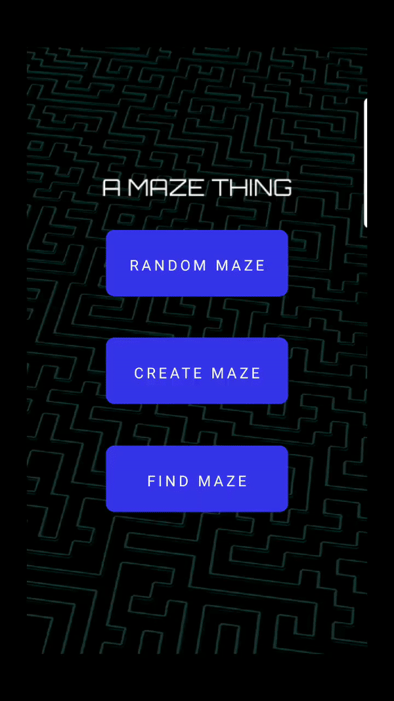
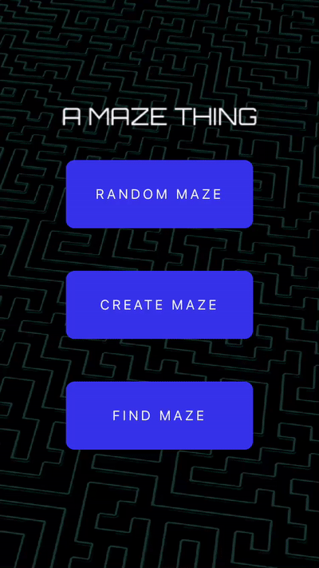

# A Maze Thing

In this cross-platform Augmented Reality application, players navigate a maze to collect coins in a race against time. Players can also build their own maze to challenge friends and search for user-built mazes.

# Features

<h3>Coin Collection</h3>


<h3>Maze Creation</h3>


<h3>Find Maze</h3>


### Prerequisites & Installing

```
npm install
```

Install the Viro Media app on ios/android. Sign up for an API key from viromedia.com. Install ngrok (https://ngrok.com/) and follow the steps to start.

In your terminal run:

```
npm start
```
Enter your ngrok endpoint in the Viro Media app to launch.

## Built With

* [React Native](https://facebook.github.io/react-native/) - Framework for Android and ios
* [Node.js](https://nodejs.org/en/) - JavaScript Runtime
* [Viro](https://viromedia.com/) - AR/VR Library
* [Axios](https://www.npmjs.com/package/axios) - HTTP client

## Authors

* **Kevin Lin** - *Developer*
* **Alex Yi** - *Developer*
* **Edward Lee** - *Developer*
* **Alana "Ani" Kerr** - *Developer*

## Acknowledgments

* Thank you to our Fullstack instructors and fellows.
